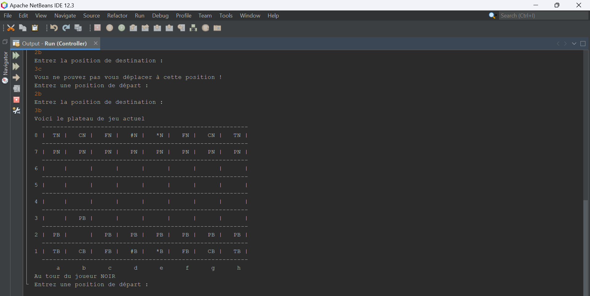

# Chess Game in Java

## Description
This project is a chess game developed in Java for a high school project. The game is designed to be played on a terminal, providing a simple yet enjoyable experience for chess enthusiasts.

## Features
- Terminal-based user interface.
- Complete implementation of chess rules.
- Detection of legal moves and validation of piece movements.
- Display of game state and pieces on an 2D array chessboard.

## Installation
1. Make sure you have Java installed on your machine.
2. Clone this repository to your local machine.
3. Run the Controller.java in your favorite IDE !
